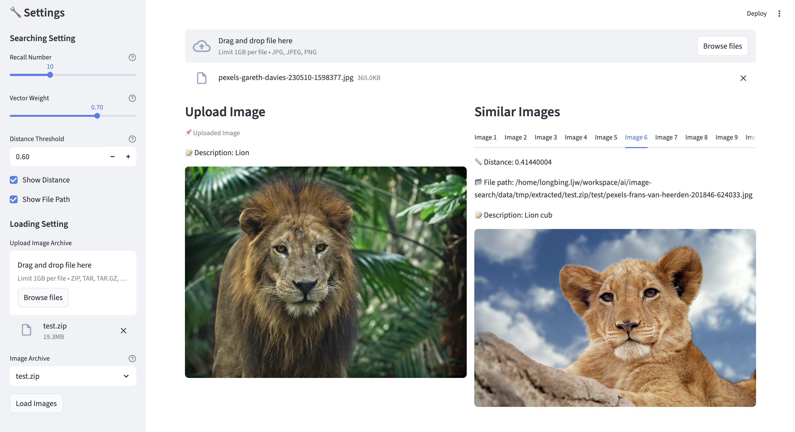

# 图像搜索应用

[English Edition](./README.md) | [日本語版](./README_ja.md)

## 介绍

凭借 OceanBase 的向量存储和检索能力，我们可以构建一个图像搜索应用。该应用会把图像嵌入为向量并存储在数据库中。用户可以上传图像，应用程序将搜索并返回数据库中最相似的图像。

注意：您需要自己准备一些图像并将 `Image Base` 配置更新到打开的 UI 中。如果您本地没有可用的图像，可以在线下载数据集，例如在 Kaggle 上的 [Animals-10](https://www.kaggle.com/datasets/alessiocorrado99/animals10/data) 数据集。

## 架构与工作原理

本项目由 4 个核心部分组成：

- **前端（Streamlit UI）**：负责图片上传、参数配置（如 top_k、搜索模式、distance_threshold）和结果展示。
- **业务层（OBImageStore）**：封装了数据集加载、多维检索以及结果融合等核心逻辑，协调各模块完成图搜任务。
- **特征与语义生成**：
  - **图片向量（Embedding）**：通过 DashScope Multimodal-Embedding API 为图片生成向量，用于相似度检索。
  - **图片描述（Caption）**：通过 OpenAI 兼容接口为图片生成短文本描述，用于全文检索与混合检索。
- **存储层（OceanBase / seekdb）**：默认使用 seekdb 容器作为向量数据库能力承载；同时维护**向量索引**与**caption 全文索引**。

下面按“数据集加载 / 图搜图”说明每一步实际做了什么（文本搜索入口当前未对外暴露）。

### 1) 数据集加载
使用方法：在侧边栏选择图片压缩包并点击 **加载图片**。
数据集加载过程：

1. **解压与扫描**：解压上传的压缩包，并扫描其中的图片文件（支持 jpg、jpeg、png 格式）。
2. **逐张处理**：
   - **读取图片**并提取基础信息。
   - **生成向量**：为图片生成向量特征（Embedding），用于后续的相似度检索。
   - **生成描述**：为图片生成短文本描述（Caption），用于后续的文本或混合检索。
3. **维护索引**：
   - **向量索引**：构建 HNSW 索引以实现高效的向量近似搜索。
   - **全文索引**：为描述字段构建全文索引，支持关键词匹配。
4. **批量入库**：将图片的文件名、路径、描述及向量特征批量写入 OceanBase / seekdb。

补充说明：

- **make init 会建表/建索引**：初始化脚本会执行建表，并创建向量索引 + caption 全文索引；如果表已存在会跳过。
- **Load 过程中也会兜底建表**：即使没有先执行建表命令，业务层在首次入库时也会检测表是否存在，不存在则创建。

### 2) 图搜图
使用方法：上传一张图片并点击搜索。
查询过程：

1. **上传图片**：前端上传图片，作为搜索输入。
2. **生成查询特征**：
   - **向量特征**：提取图片的向量，用于与数据库中的图片进行向量相似度检索。
   - **文本特征**：为图片生成文字描述（Caption），用于在数据库中进行全文检索。
3. **按搜索模式执行召回与排序**：
   - **全文检索**：仅通过 caption 全文索引召回结果。
   - **混合检索**：同时使用向量召回与全文召回，并通过 pyseekdb 原生 `hybrid_search`（RRF）进行融合排序。
   - **向量检索**：仅通过向量索引进行相似度搜索，并支持通过 `distance_threshold` 过滤不相关结果。
4. **返回 Top K**：输出最终的 Top K 结果。


## 快速启动（推荐）

使用 Docker Compose 一键启动应用和数据库。

### 1. 配置环境变量

```bash
cd docker
cp .env.example .env
```

编辑 `docker/.env` 文件，配置以下必需项：

```bash
# 图片向量生成 API Key（必需）
EMBEDDING_API_KEY=sk-your-dashscope-key

# 图片描述生成 API Key（混合/文本搜索时必需，纯向量搜索可不配置）
VLM_API_KEY=sk-your-dashscope-key

# 数据库选择（seekdb 或 oceanbase）
DB_STORE=seekdb
```

### 2. 启动服务

```bash
docker compose up -d
```

### 3. 访问应用

打开浏览器访问 `http://localhost:8501`，在侧边栏上传图片压缩包加载数据集，然后即可开始搜索。

### 4. 停止服务

```bash
docker compose down
```

---

## 本地开发部署

如果您希望在本地环境直接运行（不使用 Docker），可按以下步骤操作。

### 准备工作

1. 安装 [uv](https://github.com/astral-sh/uv) 作为依赖管理工具。

```bash
curl -LsSf https://astral.sh/uv/install.sh | sh
```

2. 确保系统中 `make` 命令可用。

### 1. 配置环境变量

将 `.env.example` 文件复制为 `.env` 并根据需要修改配置。

```bash
cp .env.example .env
```

**重要配置项：**

- **EMBEDDING_API_KEY**（必需）：用于图片向量生成的 API 密钥
  - 访问 [阿里云 DashScope](https://dashscope.console.aliyun.com/apiKey) 获取 API Key
- **VLM_API_KEY**（混合/全文检索模式必需）：用于图片描述生成的 API 密钥
  - 如果只使用向量检索模式（仅向量），则不需要配置
  - 支持 OpenAI、Qwen（通义千问）等兼容 OpenAI API 的服务

其他配置项（通常使用默认值即可）：

- **EMBEDDING_TYPE**：Embedding 后端类型（默认 `dashscope`）
- **EMBEDDING_MODEL**：Embedding 模型名称（默认 `tongyi-embedding-vision-plus`）
- **EMBEDDING_DIMENSION**：向量维度（默认 `1024`）
- **VLM_BASE_URL**：图片描述 API 服务地址（默认为 Qwen 的服务地址）
- **MODEL**：图片描述使用的模型名称（默认为 `qwen-vl-max`）

示例配置（`.env`）：
```bash
# 必需配置
EMBEDDING_API_KEY=sk-your-dashscope-key
VLM_API_KEY=sk-your-dashscope-key

# 可选配置（使用默认值）
EMBEDDING_TYPE=dashscope
EMBEDDING_MODEL=tongyi-embedding-vision-plus
EMBEDDING_DIMENSION=1024
VLM_BASE_URL=https://dashscope.aliyuncs.com/compatible-mode/v1
MODEL=qwen-vl-max
```

### 2. 初始化环境

该命令将启动 OceanBase 数据库容器并安装所有依赖。

```bash
make init
```

### 3. 启动应用

```bash
make start
```

### 4. 处理并存储图像数据

打开应用界面之后，您可以在左侧侧边栏中看到"Image Base"的输入框，在其中填写您准备的图片目录的绝对路径，然后点击"Load Images"按钮。应用程序将处理并存储这些图像数据，您将在界面上看到图片处理进度。

### 5. 使用图像搜索

在图片处理完成后，您将在界面中上方看到图片上传操作栏，您可上传一张图片用于搜索相似图片。上传图片后，应用程序将搜索并返回数据库中最相似的一些图片，默认返回最相似的前 10 张图片。



## 其他命令

### 停止应用

```bash
make stop
```

### 清理资源

```bash
make clean
```

## 常见问题

### 1. Docker 安装遇到问题怎么办？

如果您在安装 Docker 或启动 OceanBase 容器时遇到任何问题，可以访问 [OceanBase OBI](https://www.oceanbase.com/obi) 寻求帮助。
